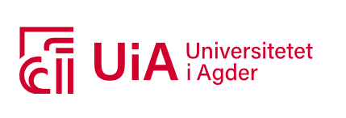

# Tegwell Teams Up with University of Agder on a Novel Geothermal Project

*Bergen, Norway* – Tegwell is thrilled to announce its upcoming research collaboration with the University of Agder. Thanks to the support from RFF Vestland, we are diving deep into novel ways of harnessing geothermal energy.

## Thermoelectric Generators: A Game Changer

The heart of this project lies in the development of thermoelectric generators, envisioned to power fully autonomous plants. More than just autonomy, these generators aim to simplify the operation so much that even individuals with minimal technical background can manage them, opening doors to a wider range of operators.

## Revolutionizing Closed-Loop Systems

Building on the foundation of closed-loop geothermal wells, the research aims to amplify their capabilities. With techniques such as radial jet drilling and hydraulic fracturing in the spotlight, our team hopes to magnify heat transfer rates, thereby enhancing overall efficiency.

## Setting Sights on a Brighter, Sustainable Future

As Tegwell joins hands with the academic stalwarts at the University of Agder, we remain committed to pioneering innovative and sustainable energy solutions that can truly make a difference.

by Tomas Finnøy — Thursday, September 1, 2022
