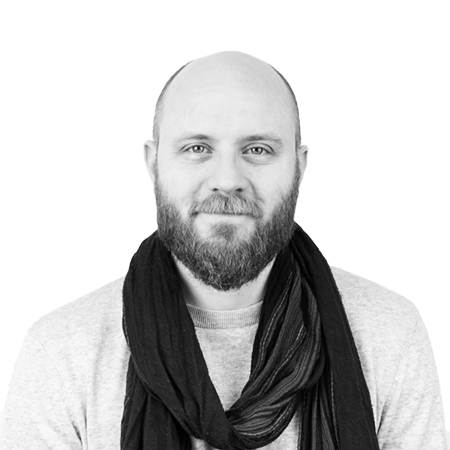
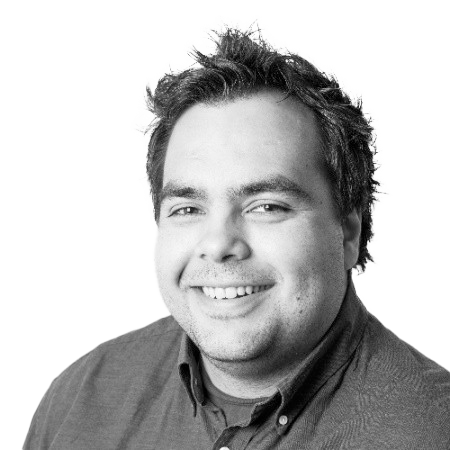
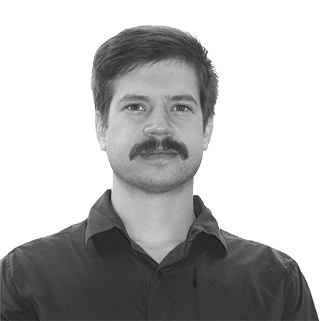
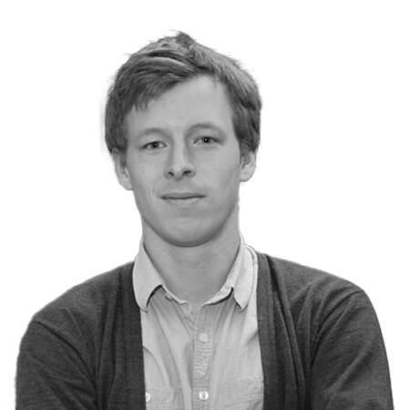

# The Team

## Tomas Finnøy — CEO

The visionary leading Tegwell into a sustainable future, Tomas is the driving force behind our mission to revolutionize renewable energy.

[LinkedIn](https://no.linkedin.com/in/tomas-finn%C3%B8y-79ba9313)

## Sondre Slathia — CTO

Overseeing the production and automation aspects of our projects, Sondre brings a balanced blend of technical and managerial expertise to Tegwell.

[LinkedIn](https://no.linkedin.com/in/sondre-slathia-ab975353)

## Benjamin D Smith — Geothermal Energy Engineer

Benjamin is our geological expert currently pursuing a Ph.D. in well bore technologies. He is instrumental in simulating and developing our Enhanced Geothermal Well solutions.

[LinkedIn](https://is.linkedin.com/in/benjamin-smith-2a3293162)

## Gunstein Skomedal — Specialist in Thermoelectric Technology

Associate professor at University of Agder with research on energy materials. PhD in thermoelectrics. He is leading the development of the thermoelectric power plant.

[LinkedIn](https://www.linkedin.com/in/gunstein-skomedal-4aa43223)
