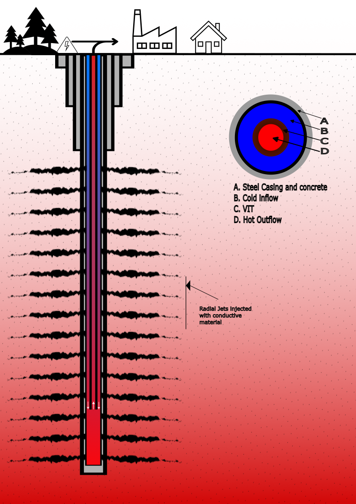

# Optimized Closed-Loop Well

Uncover the next stage in geothermal energy—Tegwell's Optimized Closed-Loop Well technology. Designed to break new ground in harnessing the Earth's heat reserves, we're setting new standards in efficient and sustainable geothermal energy production.

## Coaxial Closed-Loop Well: The Basics

A coaxial closed-loop well is a well-known concept in shallow geothermal systems, we plan to use this system in deep wells with improved efficiency. Utilization of this energy extraction will deliver on the long promised 'holy grail' of geothermal energy; giving us geothermal anywhere. This design involves a dual-pipe arrangement, where one pipe is enclosed within another, forming an annular space. In a typical closed-loop system, a working fluid circulates through this confined space, absorbing heat from the surrounding geological formations without direct interaction with them.

## Tegwell’s Innovative Approach: Optimized Closed-Loop Well

At Tegwell, we are actively developing modifications to the traditional coaxial closed-loop well to maximize its efficiency and adaptability.

## Adaptative Radial Jets

We plan to use radial jet technology that creates channels that branch from the main well, which will be filled with highly conductive materials such as graphite based composites or similar. These adaptations aim to facilitate more effective heat conduction from surrounding rocks and enable optimal heat transport. The positioning and length of the lateral channels are customizable to suit the specific geological conditions of each site. This ensures that the system can maximize heat extraction and be versatile, functioning efficiently across a variety of geological environments.

## Enhanced Operational Efficiency

We are focusing on designing a system that extracts energy efficiently as the working fluid circulates, reducing the energy needed for operation and the frequency of maintenance interventions. The goal is to create a well that can operate autonomously, optimizing the balance between energy output and operational cost.

## Vision for the Future

The optimized closed-loop well we are developing could represent a significant advancement in geothermal technology, potentially enabling broader application and bringing us a step closer to realizing the true potential of geothermal energy. This development is ongoing, and we’re working with dedication and expertise to explore the transformative possibilities this concept can bring to the geothermal energy landscape.

